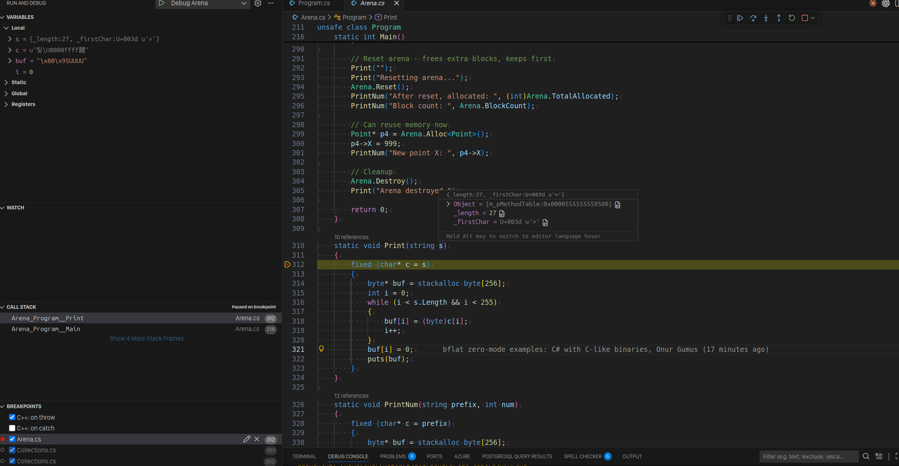

# bflat Zero Mode Examples

Exploring [bflat](https://flattened.net/) `--stdlib:zero` mode - C# compiled to tiny native binaries without any runtime.

**Zero mode is essentially "C with proper generics"** - you get C#'s syntax, type safety, and generics with C-like binary sizes (16-60 KB).

## Quick Start

### Linux
```bash
./setup.sh          # Downloads bflat
./build.sh          # Builds all examples
./bin/Arena         # Run!
```

### Windows
```powershell
.\setup.ps1         # Downloads bflat
.\build.ps1         # Builds all examples
.\bin\Arena.exe     # Run!
```

## Examples

| File | Description | Size |
|------|-------------|------|
| `Tiny.cs` | Smallest possible binary | ~16 KB |
| `Minimal.cs` | Hello world | ~45 KB |
| `Arena.cs` | Growable arena allocator with Fibonacci growth | ~50 KB |
| `Collections.cs` | Generic `List<T>` and `Dict<K,V>` | ~62 KB |
| `VirtualTest.cs` | Function pointer polymorphism (manual vtables) | ~51 KB |

## What's Special?

### Real Generics (not macros)
```csharp
var list = List<int>.Create();
list.Add(42);

var dict = Dict<Point, int>.Create();
dict.Set(new Point { X = 10, Y = 20 }, 100);
```
Type-safe, zero-overhead - compiles to the same code as hand-written C.

### Arena Allocator
```csharp
Arena.Init(64 * 1024);              // 64KB initial
Point* p = Arena.Alloc<Point>();    // Just bumps a pointer - O(1)
Arena.Reset();                       // Free everything at once - O(1)
```
Fibonacci growth strategy: 128 -> 128 -> 256 -> 384 -> 640...

### Function Pointer Polymorphism
```csharp
unsafe struct Shape {
    public delegate*<Shape*, int> GetArea;  // Type-safe function pointer
    public int Width, Height;
}

Shape rect = new Shape { GetArea = &RectangleArea, ... };
Shape circle = new Shape { GetArea = &CircleArea, ... };

int area = rect.GetArea(&rect);  // Polymorphic call
```
This is how C does OOP - but with C#'s type safety.

## Why bflat Zero Mode?

| Feature | C | bflat zero | C++ |
|---------|---|------------|-----|
| Binary size | ~10-50 KB | ~16-60 KB | ~50-200 KB |
| Generics | void*/macros | Real generics | Templates |
| Header files | Required | None | Required |
| Type safety | Weak | Strong | Medium |
| No GC | Yes | Yes | Yes |

**vs C:** Real generics, no headers, type-safe function pointers
**vs Go:** 40x smaller binaries (16KB vs 2MB)
**vs Rust:** Familiar syntax, easier learning curve

## Limitations

Zero mode has no:
- Garbage collector (manual memory)
- Exceptions
- Interfaces/virtual methods (use function pointers)
- async/await
- LINQ
- Most of the standard library

It's for embedded systems, games, CLI tools, or anywhere you want tiny binaries.

## Resources

- [bflat website](https://flattened.net/)
- [bflat GitHub](https://github.com/bflattened/bflat)
- [bflat releases](https://github.com/bflattened/bflat/releases)

## License

MIT

# bflat Zero Mode Examples



Exploring [bflat](https://flattened.net/) `--stdlib:zero` mode - C# compiled to tiny native binaries without any runtime.

**Zero mode is essentially "C with proper generics"** - you get C#'s syntax, type safety, and generics with C-like binary sizes (16-60 KB).

## Quick Start

### Linux
```bash
./setup.sh          # Downloads bflat
./build.sh          # Builds all examples
./bin/Arena         # Run!
```

### Windows
```powershell
.\setup.ps1         # Downloads bflat
.\build.ps1         # Builds all examples
.\bin\Arena.exe     # Run!
```

## Examples

| File | Description | Size |
|------|-------------|------|
| `Tiny.cs` | Smallest possible binary | ~16 KB |
| `Minimal.cs` | Hello world | ~45 KB |
| `Arena.cs` | Growable arena allocator with Fibonacci growth | ~50 KB |
| `Collections.cs` | Generic `List<T>` and `Dict<K,V>` | ~62 KB |
| `VirtualTest.cs` | Function pointer polymorphism (manual vtables) | ~51 KB |

## What's Special?

### Real Generics (not macros)
```csharp
var list = List<int>.Create();
list.Add(42);

var dict = Dict<Point, int>.Create();
dict.Set(new Point { X = 10, Y = 20 }, 100);
```
Type-safe, zero-overhead - compiles to the same code as hand-written C.

### Arena Allocator
```csharp
Arena.Init(64 * 1024);              // 64KB initial
Point* p = Arena.Alloc<Point>();    // Just bumps a pointer - O(1)
Arena.Reset();                       // Free everything at once - O(1)
```
Fibonacci growth strategy: 128 -> 128 -> 256 -> 384 -> 640...

### Function Pointer Polymorphism
```csharp
unsafe struct Shape {
    public delegate*<Shape*, int> GetArea;  // Type-safe function pointer
    public int Width, Height;
}

Shape rect = new Shape { GetArea = &RectangleArea, ... };
Shape circle = new Shape { GetArea = &CircleArea, ... };

int area = rect.GetArea(&rect);  // Polymorphic call
```
This is how C does OOP - but with C#'s type safety.

## Why bflat Zero Mode?

| Feature | C | bflat zero | C++ |
|---------|---|------------|-----|
| Binary size | ~10-50 KB | ~16-60 KB | ~50-200 KB |
| Generics | void*/macros | Real generics | Templates |
| Header files | Required | None | Required |
| Type safety | Weak | Strong | Medium |
| No GC | Yes | Yes | Yes |

**vs C:** Real generics, no headers, type-safe function pointers
**vs Go:** 40x smaller binaries (16KB vs 2MB)
**vs Rust:** Familiar syntax, easier learning curve

## Limitations

Zero mode has no:
- Garbage collector (manual memory)
- Exceptions
- Interfaces/virtual methods (use function pointers)
- async/await
- LINQ
- Most of the standard library

It's for embedded systems, games, CLI tools, or anywhere you want tiny binaries.

## Resources

- [bflat website](https://flattened.net/)
- [bflat GitHub](https://github.com/bflattened/bflat)
- [bflat releases](https://github.com/bflattened/bflat/releases)

## License

MIT
